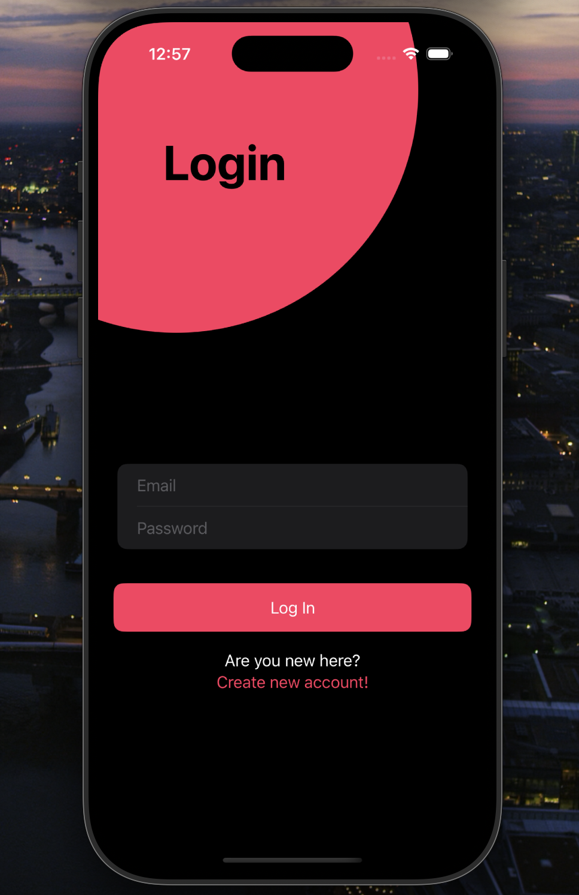
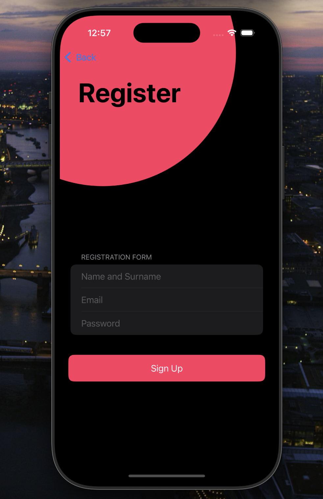
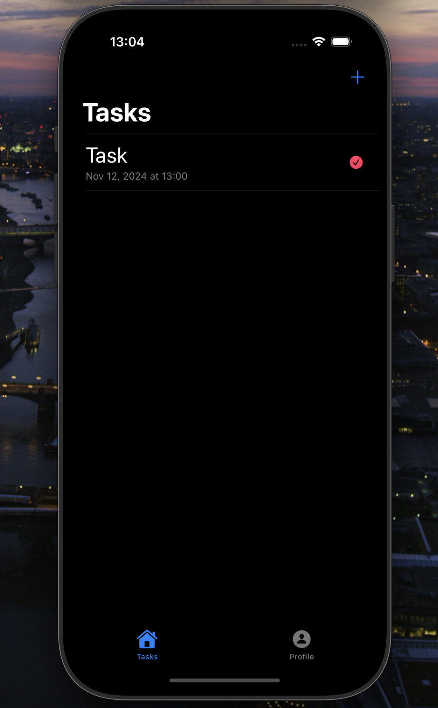
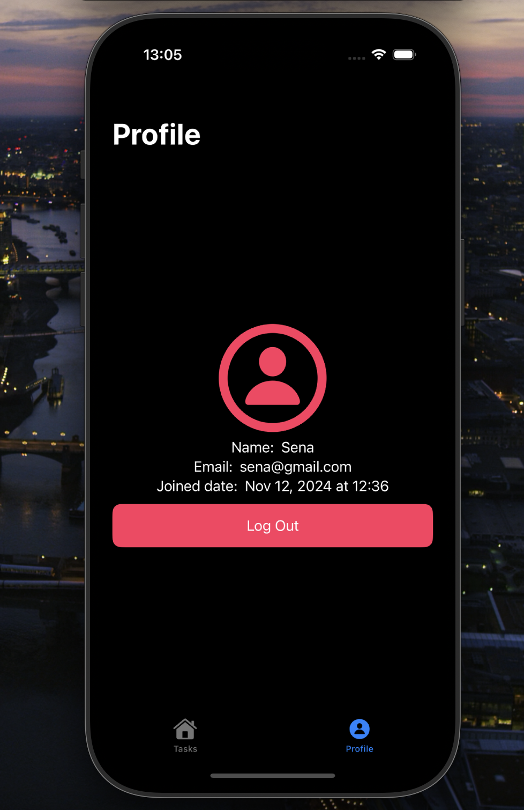
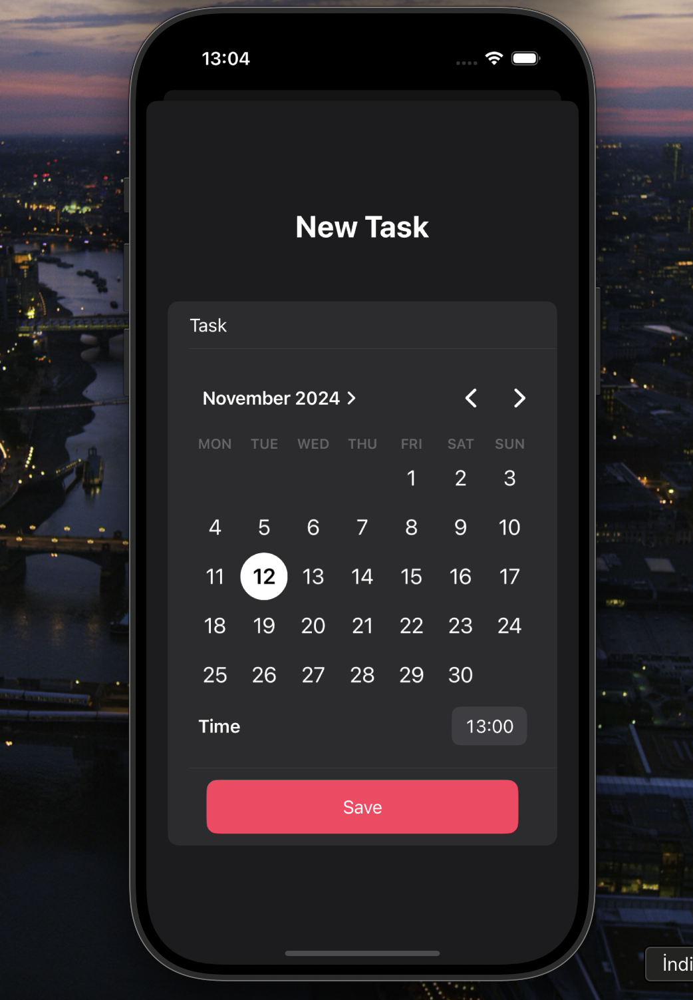

# ✅ Todo App

A simple and clean Todo app built with SwiftUI and powered by Firebase.  
You can create, delete, and mark tasks as completed — and all your data stays synced in the cloud.

## 🚀 Features

- Add new todos
- Mark tasks as done or undone
- Delete tasks
- Realtime data syncing with Firebase
- Works across devices (as long as you're logged in)

## 🛠 Technologies Used

- `SwiftUI`
- `Firebase Firestore`
- `Firebase Authentication`
- `MVVM` architecture

## 📸 Screenshots

    
